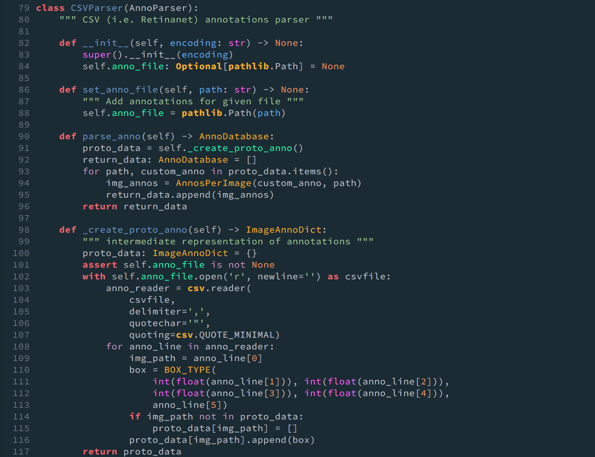

# AnnoLib

AnnoLib is a simple yet very powerful library for converting between Annotation Dataformats. To be able to read and write between **n** formats, programmers only need to implement **n** readers and **n** writers, instead of **n(n-1)** conversion classes.

## Getting Started



AnnoLib uses an intermediate representation of annotations, defined as **AnnoDatabase** datatype. Readers are required to parse the input into **AnnoDatabase** and Writers are required to accept **AnnoDatabase** and be able to write to its own format. This decouples Readers from Writers and help programmers to code independently from each others.

### Prerequisites

Python3

```
sudo apt install python3
```
Pip

```
curl https://bootstrap.pypa.io/get-pip.py -o get-pip.py
python get-pip.py --user
```

### Installing


Change the directory to root project folder

```
cd /AnnoLib/annolib
```

Compile the source code

```
python3 setup.py develop
```

## Deployment

From the perspective of a library user, you only need to initiate a reader, pass it to writer then call write() function

```python
parser = MySQLParser("utf-8",
                        "~/Desktop/PointCloudISU/WebApp/www/html/sds_images",
                        "~/Desktop/PointCloudISU/sdsgwas/src/traing_data")
writer = CSVTrainTestWriter(parser, 0.8, False)
writer.set_output_file("train.csv", "test.csv")
writer.write()
```

From the perspective of a library writer, you only need to subclass **AnnoParser** or **AnnoWriter** for reader and writer respectively. Each of those classes is an **Abstract Base Class** so instead of fail silently, it will throw error if you implement your subclass wrong

```python
class AnnoParser(metaclass=ABCMeta):
    """Abstract class for xml parser and matlab file parser"""

    def __init__(self, encoding: str) -> None:
        self.encode_method = encoding
        self.shapes: AnnoDatabase = []
        super().__init__()

    @abstractmethod
    def parse_anno(self) -> AnnoDatabase:
        """
        abstract method, will be implemented diffirently by children
        parse annotation either form .xml file or matlab json file
        """
        pass

    @property
    def anno_data(self) -> AnnoDatabase:
        """
        smart getter, just call my_parser.Anno_Data, it will check
        if ParseAnno has run yet and return annotation data.
        self.shapes = [{'bbox' =[(x1, y1, x2, y2, 'label')], 'img_path' = ''}]

        """
        # Empty List valuates to fall
        if self.shapes:
            return self.shapes
        self.shapes = self.parse_anno()
        return self.shapes
```

## Built With

* [Setuptools](https://setuptools.readthedocs.io/en/latest/) - A packaging solution for Python project

## Contributing

We follow Iowa State University [authorship policy](https://www.policy.iastate.edu/authorship), please send requests to us at the address: baskarg@iastate.edu

## Versioning

We use [git](https://git-scm.com/) for versioning. For the versions available, use the [git tagging](https://git-scm.com/book/en/v2/Git-Basics-Tagging). 

## Authors
* **Truong Tran** - [LinkedIn](https://vn.linkedin.com/in/truong-tran-62643194)

See also the research project info at [lab website](https://baskar-group.me.iastate.edu/) for detail information.

## License

Copyright 2018 Baskar Ganapathysubramanian, all rights reserved

## Acknowledgments

We gratefully acknowledge support from Plant Science Institute at Iowa State University.
