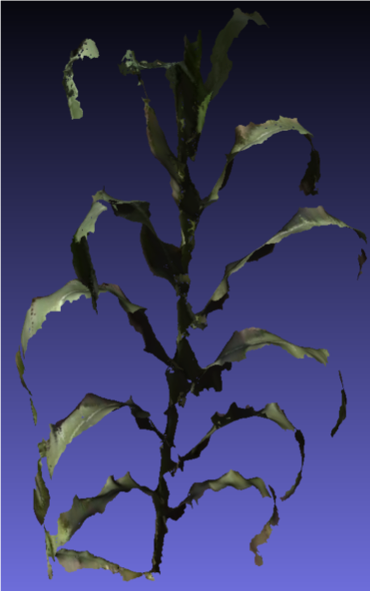
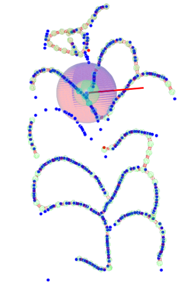
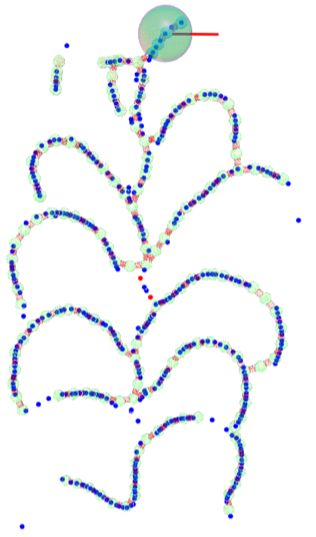

# PointCloud Skeletonization (Work-in-progress)

**PointCloud Skeletonization** is a **work-in-progress** pipeline to read Point Cloud from a lazer scanner, register multiple viewpoints and extact the **visual skeleton** of the scanned objects. We are particularly interested in Corn plants in field condition. At the moment, the algorithm work reasonably well with fully scanned plant; however, **missing parts (due to ooclusion) and non-linear skeleton body** is still to be addressed.

## Getting Started

Input PointCloud             |  Previous algorithm          |   Enhanced algorithm
:-------------------------:|:-------------------------:|:-------------------------:
  |   | 

Based largely on the paper [L1-medial skeleton of point cloud](http://202.182.120.255/file/upload_file/image/research/att201801101049/1515552573849.pdf) and their implementation, PointCloud Skeletonization make several changes to make the algorithm works better with plant:

* **A new randomize algorithm**: One critical step of skeletonization is sub-sampling from Point Cloud. This step reduces computational cost and prevent overfitting. However, a normal randomize algorithm doesn't sample the space evenly, instead we use quasi-random generator to generate **low-discrepancy sequence** of points, which help with finer detail.
* **Various tweak to reduce aggressive merging of branches**: Plants usually have much more branches compared to everyday ojects. Various steps of the algorithm try to smooth the skeleton points, which unintentionally merges real branches. We tweak its **hyper parameter** so the fitting process gives better result. This part is **empirical**
* Move windows specific code to cross platform **Qt4** code and **Cmake** build system.

### Prerequisites

Install compiler and tooling for compiling software

```
sudo apt update
sudo apt install build-essentials
```

Install dependencies

```
sudo apt install cmake
sudo apt install libqt4-dev 
sudo apt install libglew-dev
sudo apt install freeglut3-dev
```

### Installing


Change the directory to root project folder

```
cd ./l1windows/Point-Cloud_Procesing_1_0/point_cloud_1_0_source_code/PointCloud
```

Create a folder for out of source build

```
mkdir build
cd build
```

To build on Unix OS (i.e Ubuntu, Mac OS)

```
cmake ..
make -j8
```

To build on Microsoft Windows

```
cmake .. -G "Visual Studio 10"
double click the generated project file -> click build
```

## Deployment

Please follow the tutorial videos, which are available in Tutorial folder for step by step guide to use this software.

## Built With

* [Cmake](https://cmake.org/) - CMake is an open-source, cross-platform family of tools designed to build, test and package software
* [Qt Framework](https://www.qt.io/) - Qt is a free and open-source widget toolkit for creating graphical user interfaces as well as cross-platform applications that run on various software and hardware platforms.
* [OpenGL](https://www.opengl.org/) - Open Graphics Library (OpenGL) is a cross-language, cross-platform application programming interface (API) for rendering 2D and 3D vector graphics.
* [Glew](http://glew.sourceforge.net/) - The OpenGL Extension Wrangler Library (GLEW) is a cross-platform C/C++ library that helps in querying and loading OpenGL extensions.
* [Glut](https://www.opengl.org/resources/libraries/glut/) - The OpenGL Utility Toolkit (GLUT) is a library of utilities for OpenGL programs, which primarily perform system-level I/O with the host operating system

## Contributing

We follow Iowa State University [authorship policy](https://www.policy.iastate.edu/authorship), please send requests to us at the address: baskarg@iastate.edu

## Versioning

We use [git](https://git-scm.com/) for versioning. For the versions available, use the [git tagging](https://git-scm.com/book/en/v2/Git-Basics-Tagging). 

## Authors
* **Truong Tran** - [LinkedIn](https://vn.linkedin.com/in/truong-tran-62643194)

See also the research project info at [lab website](https://baskar-group.me.iastate.edu/) for detail information.

## License

Copyright 2018 Baskar Ganapathysubramanian, all rights reserved

## Acknowledgments

We gratefully acknowledge support from Plant Science Institute at Iowa State University.
